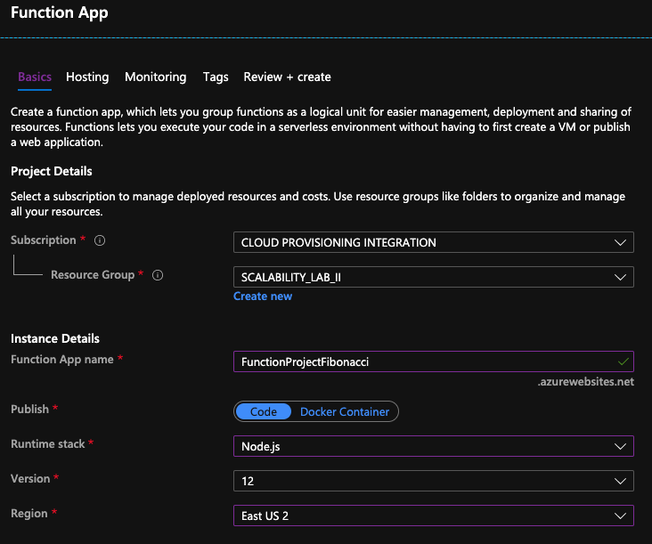

### Escuela Colombiana de Ingeniería
### Arquitecturas de Software - ARSW

## Escalamiento en Azure con Maquinas Virtuales, Sacale Sets y Service Plans

### Dependencias
* Cree una cuenta gratuita dentro de Azure. Para hacerlo puede guiarse de esta [documentación](https://azure.microsoft.com/en-us/free/search/?&ef_id=Cj0KCQiA2ITuBRDkARIsAMK9Q7MuvuTqIfK15LWfaM7bLL_QsBbC5XhJJezUbcfx-qAnfPjH568chTMaAkAsEALw_wcB:G:s&OCID=AID2000068_SEM_alOkB9ZE&MarinID=alOkB9ZE_368060503322_%2Bazure_b_c__79187603991_kwd-23159435208&lnkd=Google_Azure_Brand&dclid=CjgKEAiA2ITuBRDchty8lqPlzS4SJAC3x4k1mAxU7XNhWdOSESfffUnMNjLWcAIuikQnj3C4U8xRG_D_BwE). Al hacerlo usted contará con $200 USD para gastar durante 1 mes.

### Parte 0 - Entendiendo el escenario de calidad

Adjunto a este laboratorio usted podrá encontrar una aplicación totalmente desarrollada que tiene como objetivo calcular el enésimo valor de la secuencia de Fibonnaci.

**Escalabilidad**
Cuando un conjunto de usuarios consulta un enésimo número (superior a 1000000) de la secuencia de Fibonacci de forma concurrente y el sistema se encuentra bajo condiciones normales de operación, todas las peticiones deben ser respondidas y el consumo de CPU del sistema no puede superar el 70%.

### Escalabilidad Serverless (Functions)

1. Cree una Function App tal cual como se muestra en las  imagenes.

2. Instale la extensión de **Azure Functions** para Visual Studio Code.

3. Despliegue la Function de Fibonacci a Azure usando Visual Studio Code. La primera vez que lo haga se le va a pedir autenticarse, siga las instrucciones.

4. Dirijase al portal de Azure y pruebe la function.

5. Modifique la coleción de POSTMAN con NEWMAN de tal forma que pueda enviar 10 peticiones concurrentes. Verifique los resultados y presente un informe.

6. Cree una nueva Function que resuleva el problema de Fibonacci pero esta vez utilice un enfoque recursivo con memoization. Pruebe la función varias veces, después no haga nada por al menos 5 minutos. Pruebe la función de nuevo con los valores anteriores. ¿Cuál es el comportamiento?.

    | N | ¿Falló? |
    | ---------- | ---------- |
    | 10 | NO |
    | 100 | NO |
    | 1000 | NO |
    | 10000 | NO |
    | 100000 | SI|
    | 1000000 | SI|
    
    Pasado cada minuto, por defecto, la consola de comandos de la función de Azure comunica que no se ha hecho alguna solicitud en ese tiempo.

**Preguntas**

* ¿Qué es un Azure Function?
    * Azure Functions le permite ejecutar pequeños fragmentos de código en un cli sin preocuparse por la infraestructura de la aplicación.Permite que la infraestructura de la nube se mantenga actualizada funcionando a escala.

Una función se activa por un tipo específico de evento.Pueden incluir las respuestas a cambios en los datos, responder a mensajes, ejecutar según una programación o como resultado de una solicitud HTTP.

* ¿Qué es serverless?
    * La computación sin servidor es un modelo de ejecución de computación en la nube en el que el proveedor (En este caso Azure) de la nube ejecuta el servidor y administra dinámicamente la asignación de recursos de la máquina. El precio se basa en la cantidad real de recursos consumidos por una aplicación, en lugar de en unidades de capacidad compradas previamente.
    
* ¿Qué es el runtime y que implica seleccionarlo al momento de crear el Function App?
    * El runtime es el ambiente de compilación compatible con los escenarios de producción que brinda el proveedor. En azure se puede configurar con tres versiones: 1.x, 2.x y 3.x. 
    
        En la siguiente imagen podemos observar las diferentes configuraciones de runtime:
        

    De forma predeterminada, las aplicaciones de funciones creadas en Azure Portal y mediante la CLI de Azure están configuradas en la versión 3.x. Solo puede cambiar la versión en tiempo de ejecución a 1.x después de crear su aplicación de función, pero antes de agregar cualquier función. Se permite moverse entre 2.xy 3.x incluso con aplicaciones que tienen funciones, pero aún así se recomienda probar primero en una nueva aplicación.

* ¿Por qué es necesario crear un Storage Account de la mano de un Function App?
    * Al crearse una Function app se debe crear o vincular a una cuenta de Azure Storage de uso general que admita Blob, Queue y Table Storage. Esto se debe a que Functions se basa en Azure Storage para operaciones como la administración de desencadenadores y el registro de ejecuciones de funciones. Algunas cuentas de almacenamiento no admiten colas y tablas. Estas cuentas incluyen cuentas de almacenamiento solo de blobs, Azure Premium Storage y cuentas de almacenamiento de uso general con replicación ZRS. Estas cuentas no admitidas se filtran desde la hoja Cuenta de almacenamiento al crear una aplicación de función.
    
* ¿Cuáles son los tipos de planes para un FunctioApp?, ¿En qué se diferencias?, mencione ventajas y desventajas de cada uno de ellos.                   
  Existen dos tipos de planes:
  
  1.  Plan de consumo: se factura en función del consumo de recursos y las ejecuciones por segundo:  
        - Ejecuciones: Functions se factura según el número total de ejecuciones solicitadas cada mes para todas las funciones. Las ejecuciones se cuentan cada vez que se ejecuta una función en respuesta a un evento, desencadenado por un enlace. El primer millón de ejecuciones es gratis cada mes.  
        - Consumo de recursos: Functions se factura según el número total de ejecuciones solicitadas cada mes para todas las funciones. Las ejecuciones se cuentan cada vez que se ejecuta una función en respuesta a un evento, desencadenado por un enlace. El primer millón de ejecuciones es gratis cada mes.
  2.  Plan Premium: El plan Premium de Azure Functions ofrece a los clientes las mismas características y el mismo mecanismo de escalado que se utilizan en el plan Consumo (basado en el número de eventos) sin arranque en frío, con rendimiento mejorado y acceso a VNET. El plan Premium de Azure Functions se factura según el volumen de vCPU y memoria que consumen las funciones.                                       
  
* ¿Por qué la memoization falla o no funciona de forma correcta?                                            
    La memoization falla porque el stack de llamadas está lleno, es decir, al hacer una solicitud con un valor muy grande este llega a su limite por defecto.
* ¿Cómo funciona el sistema de facturación de las Function App?                                       
    El plan de consumo de Azure Functions se factura en función del consumo de recursos y las ejecuciones por segundo. Los precios del plan de consumo incluyen una concesión gratuita mensual de 1 millones de solicitudes y 400.000 GB-segundos de consumo de recursos por suscripción en el modelo de precios de pago por uso, para todas las aplicaciones de funciones de esa suscripción. El plan Azure Functions Premium proporciona un rendimiento mejorado y se factura por segundo en función del número de vCPU/s y de GB/s que consuman sus funciones premium. Los clientes también puede ejecutar Functions dentro de su plan de App Service a las tarifas normales del plan de App Service.
* Informe     

| Solicitud  | Tiempo promedio | ¿Falló? |
| ---------- | ---------- |---------- |
   | 1   | 10.3s    |NO |
   | 2   | 1.074s   |NO |
   | 3   | 1.807s   |NO |
   | 4   | 1.886s   |NO |
   | 5   | 1.679s   |NO |
   | 6   | 1.691s   |NO |
   | 7   | 1.970s   |NO |
   | 8   | 1.792s   |NO |
   | 9   | 1.739s   |NO |
   | 10  | 1.607s   |NO |

